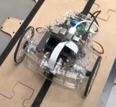
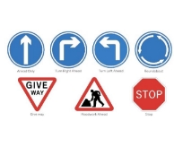

# Autonomous Vehicle Control with ROS and AI

## Abstract

In this project, we tackle the challenge of controlling the movement and navigation of a differential robot provided by Manchester Robotics. The robot is equipped with components such as a Jetson Nano and a hackerboard, on which we implemented computer vision using YOLOv5 for traffic sign detection and a line follower. Additionally, we implemented control algorithms to regulate the robot's speed. To test the robot's functionality, we successfully navigated it through a provided track while detecting and reacting to traffic signs.

#### Keywords: Robot differential · Jetson Nano · Control · YOLOv5 · Traffic sign detection · Computer vision · Manchester Robotics.

## Introduction

This project explores intelligent robotics' impact on autonomous driving and vehicles. Our challenge is guiding the puzzlebot, an autonomous vehicle, through an obstacle-filled course. Manchester Robotics provided a scaled highway for this purpose. The puzzlebot must follow the black line on the highway and respond to various traffic signals. This ReadMe presents our methodologies, experiments, and results, combining computer vision, neural networks, control algorithms, and hardware components like Jetson Nano and hackerboard.

  

Fig. 1: Autopista escala para puzzlebot

  

Fig. 2: Senales utilizadas en la autopista

## Methodology

We divided the problem-solving process into two main parts: control and neural vision.

### Control
- Initially, we worked with open-loop control through simulations in Gazebo, obtaining good results.
- Then, we implemented closed-loop control on the puzzlebot but could only test it in the simulator due to hardware issues.
- The hardware problem was later identified in faulty encoders, and the control on the physical robot worked correctly.

### Neural Vision
- To detect signals and traffic light colors, we used a neural network for the system to recognize the type of signal through training with previous images and send corresponding speed adjustment signals to the control system via ROS messages.
- We collected around 500 images per signal from the puzzlebot camera to create a dataset.
- The dataset was manually labeled for training the model, and YOLOv5 was used for real-time object detection.
- We filtered detections with low confidence to prevent duplicate frames.
- We integrated vision and control through different ROS nodes, allowing communication and adjustments based on detected signals and line following.

## Experiments

Various experiments were conducted to test the different functionalities of the autonomous vehicle system:

1. Checking encoder states with an oscilloscope to address motor control issues.

  

Fig. 3: Revision de encoders

2. Verifying the functionality of the Puzzlebot camera.

  <table>
    <tr>
      <td align="center">
        
      </td>
      <td align="center">
        
      </td>
    </tr>
  </table>

Fig. 4: Pruebas de la camara

3. Creating a dataset of signals and traffic light colors for training the neural network.

  

Fig. 5: Correcta deteccion de las señales

4. Training the neural network and testing its ability to detect multiple signals simultaneously.

  

Fig. 6: Deteccion de varias señales al mismo tiempo

5. Implementing line-following behavior using computer vision.

  <table>
    <tr>
      <td align="center">
         
      </td>
      <td align="center">
        
      </td>
    </tr>
  </table>

Fig. 7: Seguidor de lineas en la autopista

7. Combining vision and control to enable the robot to follow lines while detecting and printing signal IDs.

## Results

The project achieved its goal of creating an autonomous driving system that follows a line and identifies signals and traffic lights on a provided track. Videos of the project's results and the complete code can be found in the provided links.

## Conclusion

During this project, we explored the significance of computer vision, neural networks, control, and hardware in creating a functioning autonomous robot
